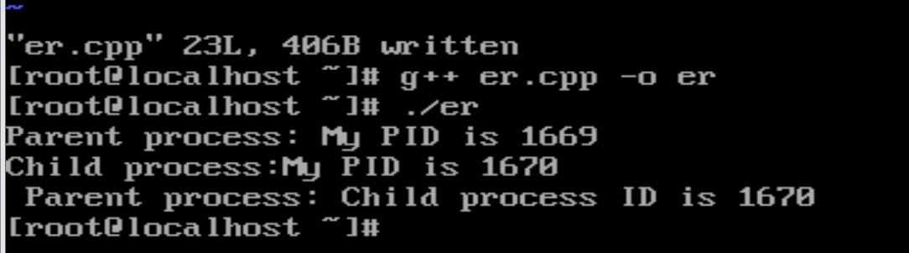
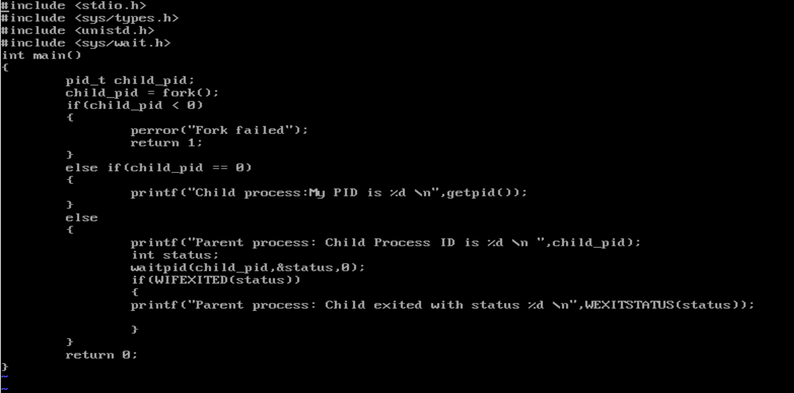

# OpenEuler进程创建与变量独立性实验
## 获取PID实验
### 1.创建源代码文件
    vi yi.cpp
### 2.进入文件编写代码
进入文件以后按“a”键进入编辑模式
在yi.cpp中编写以下代码

```c++
#include<stdio.h>
#include<sys/types.h>
#include<unistd.h>

int main()
{
    pid_t my_pid;
    my_pid = getpid();
    printf("My process ID is %d\n", my_pid);

    return 0;
}
```
如图所示：


按`ESC`退出编辑模式
按住 `shift` +`:` 并输入wq
按下回车键退出文件
### 编译并运行代码
使用如下代码编译代码

    g++ yi.cpp -o yi
运行程序

    ./yi
输出结果如图所示：

获取到的当前进程号为1753

## 进程创建与父子进程关系实验
### 1.创建源代码文件
创建文件`er`

    vi er.cpp
### 2.输入代码
    #include <stdio.h>
    #include <sys/types.h>
    #include <unistd.h>
    #include <sys/wait.h>
    int main（）
    { 
        pid_t child_pid;
        child_pid fork();
        if( child_pid < 0 )
        {
            perror("Fork failed");
            return 1;
        }
        else if( child_pid == 0 )
        printf("Child process:My PID is %d \n",getpid() );
        else
        {
            printf ("Parent process:Child Process ID is %d \n ",child_pid);
            int status;
            waitpid(child_pid,&status,0);
            if (WIFEXITED(status))
            printf ('Parent process:Child exited with status %d \n",WEXITSTATUS(status));
        }
        
        return 0:
    }
如图所示：

### 3.编译并运行代码
编译代码

    g++ er.cpp -o er
运行程序

    ./er

输出结果如图所示：


`fork()`执行成功以后父进程会产生一个子进程
父进程会输出自己的进程号和子进程号，而子进程只输出自己进程号

## 父进程等待子进程退出测试
### 1.修改`er.cpp`的代码

    vi er.cpp
修改为以下代码

```cpp
#include <stdio.h>
#include <sys/types.h>
#include <unistd.h>
#include <sys/wait.h>

int main()
{
    pid_t child_pid;
    child_pid = fork();
    if (child_pid < 0)
    {
        perror("Fork failed");
        return 1;
    }
    else if (child_pid == 0)
    {
        printf("Child process:My PID is %d \n", getpid());
    }
    else
    {
        printf("Parent process: Child process ID is %d \n", child_pid);
        int status;
        waitpid(child_pid, &status, 0);
        if (WIFEXITED(status))
        {
            printf("Parent process: Child exited with status %d\n", WEXITSTATUS(status));
        }
    }
    return 0;
}
```
如图所示：


### 2.运行代码
编译代码

    g++ er.cpp -o er

运行代码

    ./er

得到结果如下：


父进程在调用`waitpid()`后进入等待状态，知道子进程正常退出以后继续执行代码

## 多次fork()进程创建实验
### 1.编写代码
    #include<stdio.h>
    #include<sys/types.h>
    #include<unistd.h>
    
    int main()
    {
        fork();
        fork();
        fork();
        printf("laicai\n");
        return 0;
    }

### 2.创建结果保存文件
创建结果保存文件demo318

    touch demo318.txt
### 3.编译并将结果导入到txt文件

    g++ laicai.cpp -o laicai
    
    ./laicai > demo318.txt

得到结果如下：


多次调用`fork()`函数会以指数形式创建进程
第一次`fork()`以后两个进程
第二次`fork()`以后四个进程
第三次`fork()`以后八个进程
......
每次使用`fork()`以后都会将每个进程复制一遍

## 进程独立性实验
### 1.编写代码
    #include <stdio.h>
    #include <sys/types.h>
    #include <unistd.h>
    #include <stdlib.h>
    
    int main()
    {
        int x = 1;
        pid_t p = fork();
        if (p < 0)
        {
            perror("fork fail");
            exit(1);
        }
        else if (p == 0)
            printf("Child has x = %d \n", ++x);
        else
            printf("Parent has x = %d\n", --x);
    
        return 0;
    }

### 2.运行代码


这表明父子进程拥有独立的内存空间

**思考题**

- 若父进程不调用`waitpid()`，子进程退出后会成为僵尸进程，如何避免？

### **方法：使用信号处理函数（SIGCHLD）**

当子进程退出时，内核会向父进程发送`SIGCHLD`信号。父进程可通过捕获该信号并调用`waitpid()`回收子进程资源。 **代码示例**：

```
C
#include <signal.h>
#include <sys/wait.h>

void sigchld_handler(int signo) {
    while (waitpid(-1, NULL, WNOHANG) > 0);  // 非阻塞回收所有子进程
}

int main() {
    signal(SIGCHLD, sigchld_handler);  // 注册SIGCHLD信号处理函数
    pid_t pid = fork();
    if (pid == 0) {
        // 子进程逻辑
        exit(0);
    } else {
        // 父进程逻辑（无需调用waitpid）
        while (1);  // 父进程持续运行
    }
    return 0;
}
```

- 多次`fork()`可能导致系统资源耗尽，应如何限制进程数量？

#### 使用信号量限制并发进程数

通过信号量（Semaphore）控制同时存在的进程数量。 **示例代码**：

```
C#include <stdio.h>
#include <unistd.h>
#include <semaphore.h>
#include <sys/wait.h>
#include <sys/mman.h>

#define MAX_PROCESSES 4  // 最大并发进程数

int main() {
    sem_t *sem = sem_open("/proc_sem", O_CREAT, 0666, MAX_PROCESSES);
    for (int i = 0; i < 10; i++) {  // 模拟多次任务
        sem_wait(sem);  // 等待可用资源
        pid_t pid = fork();
        if (pid == 0) {  // 子进程执行任务
            printf("Child %d: laicai\n", getpid());
            sleep(1);    // 模拟任务执行
            sem_post(sem);  // 释放信号量
            _exit(0);
        } else if (pid < 0) {
            sem_post(sem);  // 出错时释放信号量
            perror("fork failed");
        }
    }
    sem_close(sem);
    sem_unlink("/proc_sem");
    while (wait(NULL) > 0);  // 等待所有子进程结束
    return 0;
}
```

**效果**：

- 通过信号量确保最多`MAX_PROCESSES`个进程同时运行。
- 父进程动态创建子进程，但受信号量严格限制。
