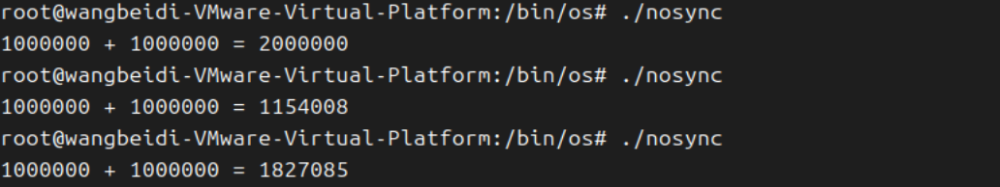
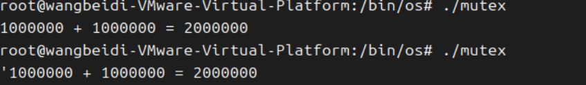
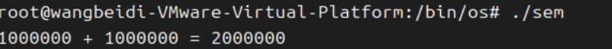
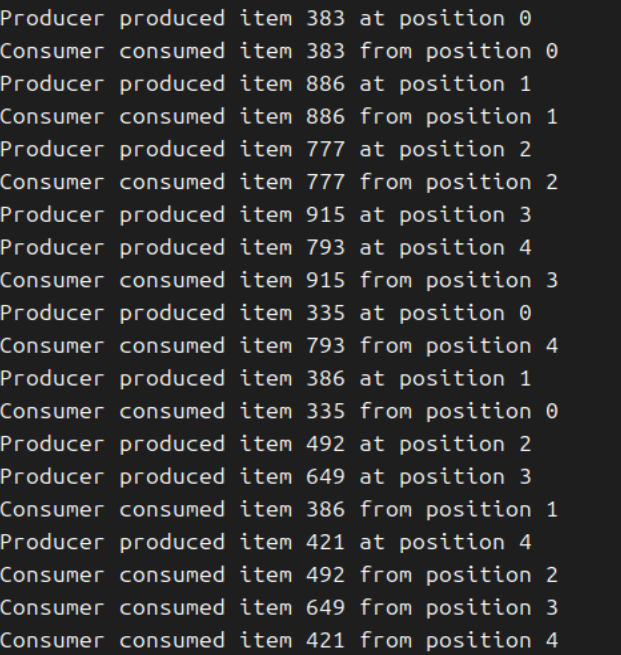

# 操作系统 实验二 Linux下的多线程编程实践


## 1.实验目标

·熟悉并掌握Linux pthread编程
·熟练掌握pthread库的同步、互斥机制，并能应用来解决实际问题

## 2.实践任务

### 2.1熟悉Linux环境下pthread编程，完成示例代码(nosync-ex.c,mutex-ex.c,sem-ex.c)的编译与执行

nosync-ex.c



```c
#include <stdio.h>
#include <pthread.h>

int sum = 0;

void *thread() {
	int i;
	for (i = 0; i < 1000000; i++) {
		++sum;
	}
	return NULL;
}

int main() {
	pthread_t tid1, tid2;
	pthread_create(&tid1, NULL, thread, NULL);
	pthread_create(&tid2, NULL, thread, NULL);
	pthread_join(tid1, NULL);
	pthread_join(tid2, NULL);
	printf("1000000 + 1000000 = %d\n", sum);
	return 0;
}
```

这个C语言程序使用了两个线程同时对共享变量 `sum` 进行自增操作，但由于缺乏同步机制，导致 **数据竞争（data race）**，最终结果不可预测且小于预期的 2,000,000。

### **预期结果**

- 每个线程增加 1,000,000 → **理论总和应为 2,000,000**。

### **实际问题：数据竞争（Race Condition）**

- ```
  ++sum
  ```

  操作不是原子的，包含三个步骤：

  1. 从内存读取 `sum` 到寄存器。
  2. 寄存器值加 1。
  3. 将结果写回内存。

- **多线程并发执行时**，上述步骤可能交错，导致中间结果被覆盖

### **解决方案1：使用互斥锁（Mutex）**

通过互斥锁确保 `++sum` 操作的原子性：

```c
#include <stdio.h>
#include <pthread.h>

int sum = 0;
pthread_mutex_t lock = PTHREAD_MUTEX_INITIALIZER;

void *thread() {
    int i;
    for (i = 0; i < 1000000; i++) {
        pthread_mutex_lock(&lock);  // 加锁
        ++sum;
        pthread_mutex_unlock(&lock); // 解锁
    }
    return NULL;
}

int main() {
    pthread_t tid1, tid2;
    pthread_create(&tid1, NULL, thread, NULL);
    pthread_create(&tid2, NULL, thread, NULL);
    pthread_join(tid1, NULL);
    pthread_join(tid2, NULL);
    printf("1000000 + 1000000 = %d\n", sum);
    return 0;
}
```



## **解决方案2：使用信号量机制（semaphore）**

我们可以通过以下步骤使用信号量机制解决该问题：

1. **定义信号量**：作为共享资源的访问控制。
2. **初始化信号量**：设置初始值为 `1`，表示资源可用。
3. **在临界区前后加锁**：使用 `sem_wait()` 和 `sem_post()` 保护 `++sum` 操作。
4. **销毁信号量**：在程序结束前释放资源。

###  代码

```c
#include <stdio.h>
#include <pthread.h>
#include <semaphore.h>

int sum = 0;
sem_t sem;  // 定义信号量

void *thread_func(void *arg) {
    for (int i = 0; i < 1000000; i++) {
        sem_wait(&sem);  // P操作：申请资源
        ++sum;
        sem_post(&sem);  // V操作：释放资源
    }
    return NULL;
}

int main() {
    pthread_t tid1, tid2;

    // 初始化信号量，初始值为1（二元信号量）
    sem_init(&sem, 0, 1);

    // 创建两个线程
    pthread_create(&tid1, NULL, thread_func, NULL);
    pthread_create(&tid2, NULL, thread_func, NULL);

    // 等待线程结束
    pthread_join(tid1, NULL);
    pthread_join(tid2, NULL);

    // 销毁信号量
    sem_destroy(&sem);

    // 输出最终结果
    printf("1000000 + 1000000 = %d\n", sum);
    return 0;
}
```



## 生产者与消费者问题

### 使用信号量（Semaphore）实现

- **`empty` 信号量**：表示缓冲区中可用的空槽位数（初始值为缓冲区大小）。
- **`full` 信号量**：表示缓冲区中已填充的数据项数（初始值为 0）。
- **`mutex` 互斥锁**：保护对缓冲区的访问，确保互斥。

（使用 POSIX 信号量）

```c
#include <stdio.h>
#include <pthread.h>
#include <semaphore.h>
#include <unistd.h>

#define BUFFER_SIZE 5  // 缓冲区大小
#define ITEM_COUNT 10  // 每个线程生产/消费的数据项数

int buffer[BUFFER_SIZE];  // 共享缓冲区
int in = 0;                // 写入位置
int out = 0;               // 读取位置

sem_t empty;  // 空槽位信号量
sem_t full;   // 已填充槽位信号量
pthread_mutex_t mutex;    // 互斥锁

void* producer(void* arg) {
    int item;
    for (int i = 0; i < ITEM_COUNT; i++) {
        item = rand() % 1000;  // 生产一个随机数

        sem_wait(&empty);      // 等待空槽位
        pthread_mutex_lock(&mutex);  // 加锁保护缓冲区

        buffer[in] = item;
        printf("Producer produced item %d at position %d\n", item, in);
        in = (in + 1) % BUFFER_SIZE;

        pthread_mutex_unlock(&mutex);  // 解锁
        sem_post(&full);       // 增加已填充项数
        usleep(500000);        // 模拟生产延迟
    }
    return NULL;
}

void* consumer(void* arg) {
    int item;
    for (int i = 0; i < ITEM_COUNT; i++) {
        sem_wait(&full);       // 等待已填充项
        pthread_mutex_lock(&mutex);  // 加锁保护缓冲区

        item = buffer[out];
        printf("Consumer consumed item %d from position %d\n", item, out);
        out = (out + 1) % BUFFER_SIZE;

        pthread_mutex_unlock(&mutex);  // 解锁
        sem_post(&empty);      // 增加空槽位数
        usleep(700000);        // 模拟消费延迟
    }
    return NULL;
}

int main() {
    pthread_t prod, cons;

    // 初始化信号量
    sem_init(&empty, 0, BUFFER_SIZE);
    sem_init(&full, 0, 0);
    pthread_mutex_init(&mutex, NULL);

    // 创建线程
    pthread_create(&prod, NULL, producer, NULL);
    pthread_create(&cons, NULL, consumer, NULL);

    // 等待线程结束
    pthread_join(prod, NULL);
    pthread_join(cons, NULL);

    // 销毁资源
    sem_destroy(&empty);
    sem_destroy(&full);
    pthread_mutex_destroy(&mutex);

    return 0;
}
```



### **3.1 pthread-ex01**

```c
C#include <stdio.h>
#include <pthread.h>

void* thread(void* vargp) {
    pthread_exit((void*)42); // 线程返回值为 42
}

int main() {
    int i;
    pthread_t tid;
    pthread_create(&tid, NULL, thread, NULL);
    pthread_join(tid, (void**)&i); // 获取线程返回值
    printf("%d\n", i); // 输出 42
    return 0;
}
```

#### **行为分析**

- 创建一个线程，线程函数通过 `pthread_exit` 返回值 42。
- 主线程通过 `pthread_join` 获取线程的返回值并打印。
- **输出**：`42`。

#### **关键点**

- `pthread_exit` 的参数是线程的返回值（类型为 `void*`）。
- `pthread_join` 的第二个参数用于接收线程返回的指针，需强制转换为 `void**` 类型。

### **3.2 pthread-ex02**

```c
C#include <stdio.h>
#include <stdlib.h>
#include <pthread.h>

void* thread(void* vargp) {
    exit(42); // 调用 exit 会终止整个进程
}

int main() {
    int i;
    pthread_t tid;
    pthread_create(&tid, NULL, thread, NULL);
    pthread_join(tid, (void**)&i); // 不会执行到这里
    printf("%d\n", i);
    return 0;
}
```

#### **行为分析**

- 线程函数调用 `exit(42)` 直接终止进程，不会执行 `pthread_join` 和后续代码。
- **输出**：程序直接终止，无输出。

#### **关键点**

- `exit()` 会终止整个进程，而非单个线程。正确的线程退出方式是使用 `pthread_exit` 或 `return`。

### **3.3 pthread-ex03**

```c
C#include <stdio.h>
#include <pthread.h>

void* thread(void* vargp) {
    int* ptr = (int*)vargp;
    pthread_exit((void*)*ptr); // 返回 ptr 指向的值
}

void* thread2(void* vargp) {
    int* ptr = (int*)vargp;
    *ptr = 0; // 修改 ptr 指向的值
    pthread_exit((void*)31);
}

int main() {
    int i = 42;
    pthread_t tid, tid2;
    pthread_create(&tid, NULL, thread, &i);   // 线程1：返回 i 的当前值（42）
    pthread_create(&tid2, NULL, thread2, &i); // 线程2：将 i 改为 0
    pthread_join(tid, (void**)&i);           // 等待线程1结束，i 变为 42
    pthread_join(tid2, NULL);                // 等待线程2结束
    printf("%d\n", i);                       // 输出 42
}
```

#### **行为分析**

- 线程1读取 `i` 的值（42），线程2将 `i` 设为 0。
- 主线程先等待线程1结束，此时线程1的返回值已确定为 42。
- **输出**：`42`。

#### **关键点**

- 线程1的返回值是 `*ptr`（即 `i` 的当前值），不会受线程2修改 `i` 的影响。
- 数据竞争风险：如果线程1和线程2同时访问 `i`，需加锁保护。

### **3.4 pthread-ex-04**

```c
C#include <stdio.h>
#include <pthread.h>

void* thread(void* vargp) {
    pthread_detach(pthread_self()); // 将线程设置为分离态
    pthread_exit((void*)42);
}

int main() {
    int i = 0;
    pthread_t tid;
    pthread_create(&tid, NULL, thread, &i);
    pthread_join(tid, (void**)&i); // 错误：分离态线程不能被 join
    printf("%d\n", i); // 未定义行为（可能崩溃或输出随机值）
}
```

#### **行为分析**

- 线程被标记为分离态（`pthread_detach`），主线程调用 `pthread_join` 会失败。
- **输出**：未定义行为（可能报错或输出随机值）。

#### **关键点**

- 分离态线程（Detached Thread）：线程结束后自动释放资源，不能通过 `pthread_join` 等待。
- 错误用法：`pthread_join` 不能用于分离态线程。

### **3.5 pthread-ex-05**

```c
C#include <stdio.h>
#include <pthread.h>

int i = 42; // 全局变量

void* thread(void* vargp) {
    printf("%d\n", i); // 读取 i 的值
}

void* thread2(void* vargp) {
    i = 31; // 修改 i 的值
}

int main() {
    pthread_t tid, tid2;
    pthread_create(&tid2, NULL, thread2, &i); // 线程2先执行
    pthread_create(&tid, NULL, thread, &i);   // 线程1后执行
    pthread_join(tid, NULL);
    pthread_join(tid2, NULL);
}
```

#### **行为分析**

- 线程2将 `i` 改为 31，线程1读取 `i` 并打印。
- **输出**：可能为 `42` 或 `31`，取决于线程调度顺序。

#### **关键点**

- 数据竞争：线程1和线程2并发访问全局变量 `i`，未同步。
- 结果不可预测，需使用互斥锁（`pthread_mutex_t`）保护。

### **3.6 pthread-ex-06**

```c
C#include <stdio.h>
#include <stdlib.h>
#include <pthread.h>

void* foo(void* vargp) {
    int myid = *((int*)vargp);
    free(vargp); // 释放传入的内存
    printf("Thread %d\n", myid);
}

int main() {
    pthread_t tid[2];
    int i;
    for (i = 0; i < 2; i++) {
        int* ptr = malloc(sizeof(int));
        *ptr = i;
        pthread_create(&tid[i], 0, foo, ptr);
    }
    pthread_join(tid[0], 0);
    pthread_join(tid[1], 0);
}
```

#### **行为分析**

- 每个线程动态分配内存传递参数，线程内部释放内存。
- **输出**：`Thread 0` 和 `Thread 1`（顺序不确定）。

#### **关键点**

- 内存管理：线程负责释放传入的内存，避免内存泄漏。
- 安全性：每个线程有独立的内存，无数据竞争。

### **3.7 pthread-ex-07**

```c
C#include <stdio.h>
#include <stdlib.h>
#include <pthread.h>

void* foo(void* vargp) {
    int myid = *((int*)vargp);
    printf("Thread %d\n", myid);
}

int main() {
    pthread_t tid[2];
    int i;
    for (i = 0; i < 2; i++) {
        pthread_create(&tid[i], 0, foo, &i); // 错误：多个线程共享变量 i
    }
    pthread_join(tid[0], 0);
    pthread_join(tid[1], 0);
}
```

#### **行为分析**

- 所有线程共享主线程的局部变量 `i`，循环中 `i` 的值可能被修改。
- **输出**：可能为 `Thread 0` 和 `Thread 1`，也可能两者都是 `1`。

#### **关键点**

- 数据竞争：所有线程共享 `i`，导致不可预测结果。
- 正确做法：为每个线程分配独立的参数（如动态分配内存）。