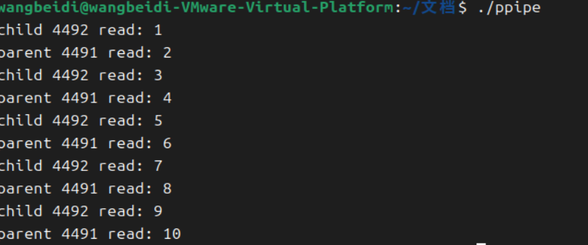
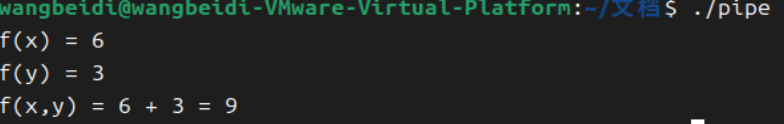

# 操作系统 实验三 进程通信实验

软2307 王贝迪 20232241399

### 1.实验⽬的 

通过熟悉Linux系统中的管道通信机制，加深对进程通信概念的理解 

观察和体验并发进程间通信和协作的效果 练习利⽤⽆名管道进⾏进程通信的编程和调试技术


```c
#include <sys/types.h>
#include <stdio.h>
//#include <unistd.h>
#include <stdlib.h>

int value=5;     //where?

int main(){
	
	int i;     //where?
	
	pid_t pid;
	
	for(i=0;i<2;i++){    // How many new processes and printfs？
		
	
		pid=fork();
	
		if(pid==0){
			value += 15;
			printf("Child: value = %d\n",value);
		}
		else if(pid>0){
			wait(NULL);
			printf("PARNET: value = %d\n",value);
			exit(0);   //Notice：What will happen with or without this line?
		}
	}
}

```

```c
int value = 5;  // 全局变量，初始值为5

int main() {
    int i;       
    pid_t pid;
    
    for (i = 0; i < 2; i++) {  // 循环执行2次
        pid = fork();          // 创建子进程
        
        if (pid == 0) {        // 子进程逻辑
            value += 15;
            printf("Child: value = %d\n", value);
        } else if (pid > 0) {  // 父进程逻辑
            wait(NULL);        // 等待子进程结束
            printf("PARENT: value = %d\n", value);
            exit(0);           // 父进程强制退出（关键语句）
        }
    }
}
```

代码解释

#### 1.**有 `exit(0)` 的情况**

- **进程创建过程**：

  - 第一次循环（i=0）

    ：

    - 父进程 P 创建子进程 C1。
    - P 执行 `wait(NULL)` 阻塞，等待 C1 结束。
    - C1 执行 `value += 15`（变为 20），打印 `Child: value = 20`。
    - C1 进入下一次循环（i=1），再次调用 `fork()`，创建子进程 C2。
    - C1 成为父进程，执行 `wait(NULL)` 等待 C2 结束。
    - C2 执行 `value += 15`（从 20 变为 35），打印 `Child: value = 35`。
    - C1 打印 `PARENT: value = 20`，然后退出。

  - **进程关系**：`P → C1 → C2`。

- **输出顺序**：

  ```bash
   Child: value = 20  // C1
  Child: value = 35  // C2
  PARENT: value = 20 // C1
  PARENT: value = 5  // P
  ```

#### **2. 无 `exit(0)` 的情况**

- **进程创建过程**：

  - 父进程 P 每次循环都不退出，导致指数级进程增长：
    - 第一次循环（i=0）：P 创建 C1。
    - 第二次循环（i=1）：P 创建 C2，C1 创建 C3。
  - 进程关系：`P → C1 → C3` 和 `P → C2 → ...`。

- **输出示例**：

  ```bash
   Child: value = 20  // C1
  PARENT: value = 5  // P（等待C1结束）
  Child: value = 35  // C3（由C1创建）
  PARENT: value = 20 // C1（等待C3结束）
  Child: value = 20  // C2（由P在i=1时创建）
  PARENT: value = 5  // P（等待C2结束）
  ...                // 更多子进程和输出
  ```

### **`fork()` 系统调用**

- **功能**：创建一个子进程，复制父进程的代码、数据和文件描述符。

- 返回值

  ：

  - 父进程返回子进程的PID（>0）。
  - 子进程返回0。
  - 失败返回-1。

- **关键点**：子进程继承父进程的管道文件描述符，实现通信。


示例代码

```c
#include <stdio.h>
#include <unistd.h>
#include <stdlib.h>

int main(int argc, char *argv[]) {
    int pid;
    int pipe1[2], pipe2[2];
    int x;

    // 创建管道
    if (pipe(pipe1) < 0) {
        perror("failed to create pipe1");
        exit(EXIT_FAILURE);
    }
    if (pipe(pipe2) < 0) {
        perror("failed to create pipe2");
        exit(EXIT_FAILURE);
    }

    pid = fork();
    if (pid < 0) {
        perror("failed to create new process");
        exit(EXIT_FAILURE);
    } 
    else if (pid == 0) { // 子进程
        // 关闭不需要的管道端
        close(pipe1[1]);  // 关闭 pipe1 的写端
        close(pipe2[0]);  // 关闭 pipe2 的读端

        do {
            // 从父进程读取数据
            read(pipe1[0], &x, sizeof(int));
            printf("child %d read: %d\n", getpid(), x++);

            // 向父进程写回数据
            write(pipe2[1], &x, sizeof(int));
        } while (x <= 9);

        // 关闭管道
        close(pipe1[0]);
        close(pipe2[1]);
    } 
    else { // 父进程
        // 关闭不需要的管道端
        close(pipe1[0]);  // 关闭 pipe1 的读端
        close(pipe2[1]);  // 关闭 pipe2 的写端

        x = 1;  // 初始化值
        do {
            // 向子进程写入数据
            write(pipe1[1], &x, sizeof(int));

            // 从子进程读取数据
            read(pipe2[0], &x, sizeof(int));
            printf("parent %d read: %d\n", getpid(), x++);
        } while (x <= 9);

        // 关闭管道
        close(pipe1[1]);
        close(pipe2[0]);
    }

    return EXIT_SUCCESS;
}
```





- 父子进程通过双向管道交替递增 `x` 的值，直到 `x > 9`。
- 每次循环：
  1. 父进程写入数据。
  2. 子进程读取后递增并写回。
  3. 父进程读取子进程返回的值。


**独立实验 设有⼆元函数 f(x,y) = f(x) + f(y)， 其中：**  

**f(x) = f(x-1)*x  (x>1)** 

 **f(x) = 1  (x=1)**

  **f(y) = f(y-1) + f(y-2)   (y>2)**

  **f(y) = 1   (y=1,2)      请编程建立3个并发协作进程，它们分别完成 f(x,y)、f(x)、f(y)。**

以下是实现三个并发进程分别计算 `f(x,y)`、`f(x)` 和 `f(y)` 的代码实现及注释：

```c
#include <stdio.h>
#include <stdlib.h>
#include <unistd.h>
#include <sys/wait.h>

// 定义全局变量 x 和 y（假设输入值）
int x = 3, y = 4;

// 计算 f(x)（阶乘）
int calc_fx(int x) {
    if (x == 1)
        return 1;
    else
        return x * calc_fx(x - 1);
}

// 计算 f(y)（斐波那契数列）
int calc_fy(int y) {
    if (y == 1 || y == 2)
        return 1;
    else
        return calc_fy(y - 1) + calc_fy(y - 2);
}

int main() {
    int pipe_fx[2], pipe_fy[2];  // 创建两个管道
    
    // 创建管道1（用于传输 f(x) 结果）
    if (pipe(pipe_fx) == -1) {
        perror("pipe_fx create error");
        exit(EXIT_FAILURE);
    }
    
    // 创建管道2（用于传输 f(y) 结果）
    if (pipe(pipe_fy) == -1) {
        perror("pipe_fy create error");
        exit(EXIT_FAILURE);
    }

    // 创建子进程1：计算 f(x)
    pid_t pid_fx = fork();
    if (pid_fx == 0) {
        close(pipe_fx[0]);  // 关闭读端
        int result = calc_fx(x);
        write(pipe_fx[1], &result, sizeof(result));
        close(pipe_fx[1]);  // 关闭写端
        exit(EXIT_SUCCESS);
    } else if (pid_fx < 0) {
        perror("fork_fx error");
        exit(EXIT_FAILURE);
    }

    // 创建子进程2：计算 f(y)
    pid_t pid_fy = fork();
    if (pid_fy == 0) {
        close(pipe_fy[0]);  // 关闭读端
        int result = calc_fy(y);
        write(pipe_fy[1], &result, sizeof(result));
        close(pipe_fy[1]);  // 关闭写端
        exit(EXIT_SUCCESS);
    } else if (pid_fy < 0) {
        perror("fork_fy error");
        exit(EXIT_FAILURE);
    }

    // 父进程：计算 f(x,y) = f(x) + f(y)
    close(pipe_fx[1]);  // 关闭管道写端
    close(pipe_fy[1]);  // 关闭管道写端

    int fx, fy;
    // 读取子进程1的结果
    if (read(pipe_fx[0], &fx, sizeof(fx)) == -1) {
        perror("read_fx error");
        exit(EXIT_FAILURE);
    }
    // 读取子进程2的结果
    if (read(pipe_fy[0], &fy, sizeof(fy)) == -1) {
        perror("read_fy error");
        exit(EXIT_FAILURE);
    }

    close(pipe_fx[0]);  // 关闭读端
    close(pipe_fy[0]);  // 关闭读端

    printf("f(x) = %d\n", fx);
    printf("f(y) = %d\n", fy);
    printf("f(x,y) = %d + %d = %d\n", fx, fy, fx + fy);

    // 等待子进程结束
    waitpid(pid_fx, NULL, 0);
    waitpid(pid_fy, NULL, 0);

    return 0;
}
```



**进程分工**

- **子进程1**：调用 `calc_fx(x)` 计算阶乘，通过管道1发送结果给父进程。
- **子进程2**：调用 `calc_fy(y)` 计算斐波那契数，通过管道2发送结果给父进程。
- **父进程**：读取两个管道的结果并求和，输出 `f(x,y)`。

**管道通信**

- 每个管道有两端：`pipe_fx[0]`（读端）和 `pipe_fx[1]`（写端）。
- 子进程关闭不需要的读端，父进程关闭不需要的写端，避免资源泄漏。